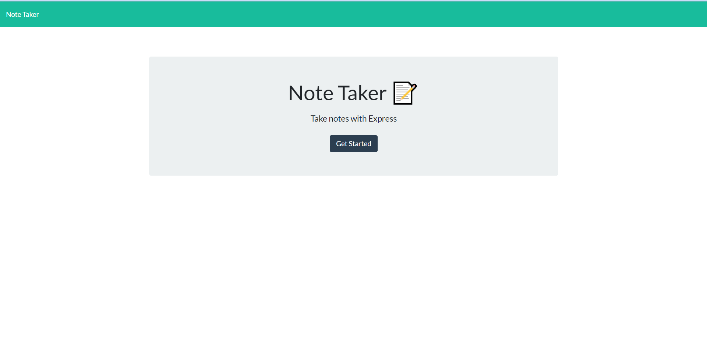
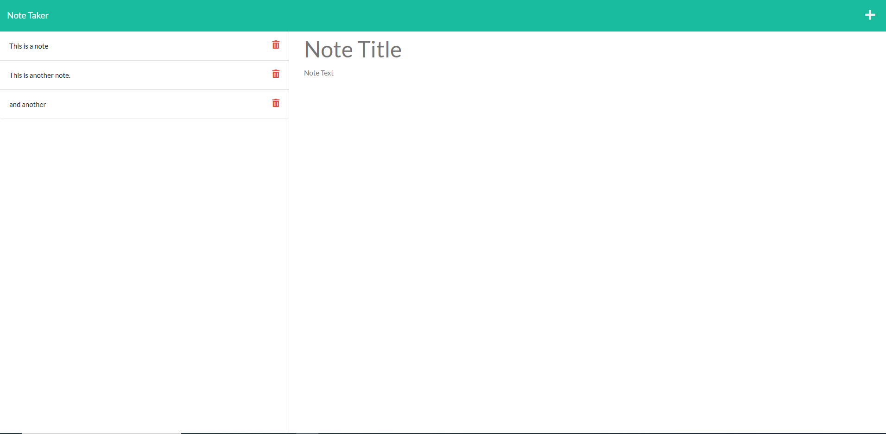

  

  
  
  
  

  

  <h1>Note Taker</h2>

  <!-- TABLE OF CONTENTS -->
  

  
Table of Contents

  <ol>
    <li><a href="#about-the-project">About The Project</a></li>
    <li><a href="#built-with">Built With</a></li>
    <li><a href="#preview">Preview</a></li>
    <li><a href="#contributing">Contributing</a></li>
    <li><a href="#license">License</a></li>
  </ol>

 

  ## About The Project
  This is a very convenient way to store notes on a simple, one-page user interface.  
  
(<a href="#top">back to top</a>)

  ## Built With
  HTML,CSS,Javascript
  
(<a href="#top">back to top</a>)

  ## Preview
  Check out a preview of the app here: https://powerful-gorge-50476.herokuapp.com/.
   
   

  
(<a href="#top">back to top</a>)

  ## Contributing
  Contributions are welcome.  Feel free to clone the repo at https://github.com/michael-orr/note-taker.
  
(<a href="#top">back to top</a>)

  ## License
  MIT https://www.gnu.org/licenses/gpl-3.0
  
  
MIT License

Copyright (c) 2021 Michael Orr

Permission is hereby granted, free of charge, to any person obtaining a copy
of this software and associated documentation files (the "Software"), to deal
in the Software without restriction, including without limitation the rights
to use, copy, modify, merge, publish, distribute, sublicense, and/or sell
copies of the Software, and to permit persons to whom the Software is
furnished to do so, subject to the following conditions:

The above copyright notice and this permission notice shall be included in all
copies or substantial portions of the Software.

THE SOFTWARE IS PROVIDED "AS IS", WITHOUT WARRANTY OF ANY KIND, EXPRESS OR
IMPLIED, INCLUDING BUT NOT LIMITED TO THE WARRANTIES OF MERCHANTABILITY,
FITNESS FOR A PARTICULAR PURPOSE AND NONINFRINGEMENT. IN NO EVENT SHALL THE
AUTHORS OR COPYRIGHT HOLDERS BE LIABLE FOR ANY CLAIM, DAMAGES OR OTHER
LIABILITY, WHETHER IN AN ACTION OF CONTRACT, TORT OR OTHERWISE, ARISING FROM,
OUT OF OR IN CONNECTION WITH THE SOFTWARE OR THE USE OR OTHER DEALINGS IN THE
SOFTWARE.
  
(<a href="#top">back to top</a>)

  
